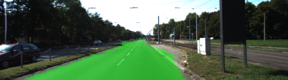
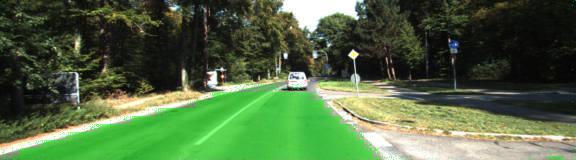

# UDACITY SELF-DRIVING CAR ENGINEER NANODEGREE
# Semantic Segmentation Project 

## Introduction

The goal of this project is to replicate the [paper by Long Shelhamer](https://people.eecs.berkeley.edu/~jonlong/long_shelhamer_fcn.pdf).

Implement a Fully Convolutional Network given starting point of pre-trained VGG-16 Fully Connected Network. With this new model, perform Semantic segmentation on images from dashcam to classify image pixels into road and non-road.

### An example of Input image:


### Expected Output image:


## Approach

### Architecture

A pre-trained VGG-16 network  converted to a fully convolutional network.
In order to convert to Fully Convolutional Network, several steps were taken:

1. The final fully connected layer [vgg_layer7_out] was hooked up to a 1x1 convolution[kernel_size=1] and  the depth equal to the number of desired classes (num_classes=2, road and not-road). 

```python
layer7a_out = tf.layers.conv2d(vgg_layer7_out, num_classes, kernel_size=1, padding= 'same',...)
```
2. layer7a_out is upsampled by a factor of 2 using conv2d_transpose. The strides= (2, 2) causes the upsampling.

```python
layer4a_in1 = tf.layers.conv2d_transpose(layer7a_out, num_classes, kernel_size=4, strides= (2, 2), padding= 'same', 
```

3. "Skip" layer is prepared.To preserve spatial info, vgg_layer4_out is added to the output of the vgg network, but before that, take a 1x1 convolution.
```python
layer4a_in2 = tf.layers.conv2d(vgg_layer4_out, num_classes, 1, padding= 'same', 
```

4. Now the 2 layers are added together
```

layer4a_out = tf.add(layer4a_in1, layer4a_in2)
```

5. The same is done with Layer 3 of the VGG net. It's directly connected to the output of the VGG16 network
```
layer3a_in1 = tf.layers.conv2d_transpose(layer4a_out, num_classes, 4,  strides= (2, 2), 
layer3a_in2 = tf.layers.conv2d(vgg_layer3_out, num_classes, 1, ...)
layer3a_out = tf.add(layer3a_in1, layer3a_in2)
```

6. Finally, in order to get back to the original width/height of the image, we need to upsample by a factor of 8 (using the strides)
```
nn_last_layer = tf.layers.conv2d_transpose(layer3a_out, num_classes, 16, strides= (8, 8),
```

#### In summary, during the upsampling process, the image was upsampled by a factor of:
2x2x8 = 32

#### Note: this matches exactly the amount of downsampling applied during the VGG-16 algorithm BEFORE applying the Fully Convolutional Network. The downsampling is achieved during the "Max Pooling" phases in between the convolution layers in VGG-16. Max pooling is employed 5 times, each time pool factor is 2. 2x2x2x2x2=32. 


### Extracting/tapping into existing layer sof VGG-16 pre-trained model
To find layer names in a trained model, use 
```python
sess.graph.get_operations() 
#this returns a list of all layers, then query each layer to get shape info
#For example: 
tf.get_default_graph().get_tensor_by_name('image_input:0')
#returns <tf.Tensor 'image_input:0' shape=(?, ?, ?, 3) dtype=float32> : 3 channels, but number of images, height and width can vary 

```

### Feed in Input Image Shape/ size
The input image size can be found by:
```python
import scipy.ndimage
data_dir = './data'
filepath=os.path.join(data_dir, 'data_road/training/image_2/uu_000097.png')
height, width, channels = scipy.ndimage.imread(filepath).shape
```

This returns:
```
print(height,width,channels)
376 1241 3
```

But we need to cut down the image size, this happens in the gen_batch_function, where image_shape is the desired new shape of image, specified in the "run" function as
```python
image_shape = (160, 576)
```
This keeps the #of channels same (3) but changes height, width

```python
get_batches_fn = helper.gen_batch_function(os.path.join(data_dir, 'data_road/training'), image_shape)

```
In the gen_batch_function, image resizing happens with:
```
image = scipy.misc.imresize(scipy.misc.imread(image_file), image_shape)
```

### 1x1 Convolution 
A visual of what 1x1 convolution does is captured in Andrew Ng's lecture, screen captured here:


1x1 convolutions are perfomed on previous VGG layers (layers 3 and 4) and adding them element-wise to upsampled (through transposed convolution) lower-level layers (i.e. the 1x1-convolved layer 7 is upsampled before being added to the 1x1-convolved layer 4). Each convolution and transpose convolution layer includes a kernel initializer and regularizer

### Transposed Convolution
A visual of transposed Convolution is found [here](https://datascience.stackexchange.com/questions/6107/what-are-deconvolutional-layers). This shows how the Transposed Convolution operator is used to upsample a given image. In essense, each pixel of the image is multipled elementwise to a given filter. Another great matrix based explanation /visual representation is [here](https://towardsdatascience.com/up-sampling-with-transposed-convolution-9ae4f2df52d0).


A quick visual how transpose convolution does 2x upsampling with 3x3 filter and stride of 2:


Sample code to verify Deconvolution:
```python
import tensorflow as tf
import numpy as np

def test_conv2d_transpose():
    # input batch shape = (1, 2, 2, 1) -> (batch_size, height, width, channels) - 2x2x1 image in batch of 1
    x = tf.constant(np.array([[
        [[1], [2]], 
        [[3], [4]]
    ]]), tf.float32)

    # shape = (3, 3, 1, 1) -> (height, width, input_channels, output_channels) - 3x3x1 filter
    f = tf.constant(np.array([
        [[[1]], [[1]], [[1]]], 
        [[[1]], [[1]], [[1]]], 
        [[[1]], [[1]], [[1]]]
    ]), tf.float32)

    conv = tf.nn.conv2d_transpose(x, f, output_shape=(1, 4, 4, 1), strides=[1, 2, 2, 1], padding='SAME')

    with tf.Session() as session:
        result = session.run(conv)

    assert (np.array([[
        [[1.0], [1.0],  [3.0], [2.0]],
        [[1.0], [1.0],  [3.0], [2.0]],
        [[4.0], [4.0], [10.0], [6.0]],
        [[3.0], [3.0],  [7.0], [4.0]]]]) == result).all()

```

### A useful site to structure the loss function, training, optimizer is [here](https://pythonprogramming.net/tensorflow-neural-network-session-machine-learning-tutorial/)


### Optimizer

The loss function for the network is cross-entropy, and an Adam optimizer is used, as described in the Udacity lectures.

### Training

The hyperparameters used for training are:

  - keep_prob: 0.6
  - learning_rate: 0.0009
  - epochs: 2
  - batch_size: 10

## Results

Loss per batch tends to average below 0.1700 after two epochs.

### Samples

Below are a few sample images from the output of the fully convolutional network, with the segmentation class overlaid upon the original image in green.





Performance is decent, but not perfect with only spots of road identified in a handful of images.

### Misc notes:
To ensure the right versions of Tensorflow, Python etc 
```
conda env create -f environment.yml
source activate carnd-term3
```

Contents of environment.yml:
```
----
name: carnd-term3
channels:
    - https://conda.anaconda.org/menpo
    - conda-forge
dependencies:
    - python==3.5
    - numpy
    - matplotlib
    - jupyter
    - opencv3
    - pillow
    - scikit-learn
    - scikit-image
    - scipy
    - h5py
    - eventlet
    - flask-socketio
    - seaborn
    - pandas
    - ffmpeg
    - imageio=2.1.2
    - pyqt=4.11.4
    - pip:
        - moviepy
        - tensorflow==1.10.1
        - keras==2.0.9
---
```

### Kernel Initializer
Setting kernel_initializer= tf.random_normal_initializer(stddev=0.01) in the transpose convolutions removed some of the green graininess that I was initially getting across the image, ruining the inference.


## *Udacity repository README*

### Introduction
In this project, you'll label the pixels of a road in images using a Fully Convolutional Network (FCN).

### Setup
##### Frameworks and Packages
Make sure you have the following is installed:
 - [Python 3](https://www.python.org/)
 - [TensorFlow](https://www.tensorflow.org/)
 - [NumPy](http://www.numpy.org/)
 - [SciPy](https://www.scipy.org/)
##### Dataset
Download the [Kitti Road dataset](http://www.cvlibs.net/datasets/kitti/eval_road.php) from [here](http://www.cvlibs.net/download.php?file=data_road.zip).  Extract the dataset in the `data` folder.  This will create the folder `data_road` with all the training a test images.

### Start
##### Implement
Implement the code in the `main.py` module indicated by the "TODO" comments.
The comments indicated with "OPTIONAL" tag are not required to complete.
##### Run
Run the following command to run the project:
```
python main.py
```
**Note** If running this in Jupyter Notebook system messages, such as those regarding test status, may appear in the terminal rather than the notebook.

### Submission
1. Ensure you've passed all the unit tests.
2. Ensure you pass all points on [the rubric](https://review.udacity.com/#!/rubrics/989/view).
3. Submit the following in a zip file.
 - `helper.py`
 - `main.py`
 - `project_tests.py`
 - Newest inference images from `runs` folder
 
 ## How to write a README
A well written README file can enhance your project and portfolio.  Develop your abilities to create professional README files by completing [this free course](https://www.udacity.com/course/writing-readmes--ud777).
